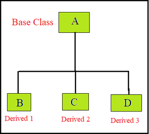

# Backend

{:width="500px" }
*Backend*

<!-- note -->

Pour mettre en œuvre l'héritage dans le backend avec Laravel, vous pouvez suivre ces étapes :

- **Définir des modèles Eloquent :** Créez des modèles pour chaque entité de votre application en utilisant Eloquent, le ORM de Laravel. Ces modèles représentent les tables de votre base de données et permettent d'interagir avec elles de manière objet.

- **Établir des relations entre les modèles :** Utilisez les méthodes de relation fournies par Eloquent (telles que belongsTo, hasMany, etc.) pour établir des liens entre les différents modèles, reflétant ainsi la structure hiérarchique de votre application.

- **Créer des contrôleurs dédiés :** Pour encapsuler la logique métier spécifique à chaque classe, créez des contrôleurs dédiés pour chaque type d'entité. Vous pouvez également définir un contrôleur de base générique contenant des méthodes communes à toutes les entités.

- **Utiliser l'héritage pour réutiliser le code :** Étendez le contrôleur de base générique avec des contrôleurs spécifiques à chaque entité. De cette façon, vous pouvez réutiliser le code commun tout en ajoutant des fonctionnalités spécifiques à chaque contrôleur.

- **Favoriser la modularité et la maintenance :** En structurant votre code de cette manière, vous favorisez la modularité et la maintenance facilitée. Les fonctionnalités communes sont regroupées dans un contrôleur de base, ce qui rend les mises à jour et les modifications plus simples à implémenter.

